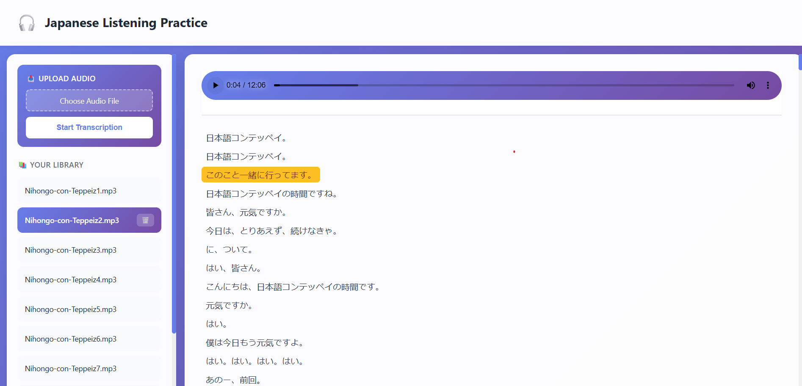
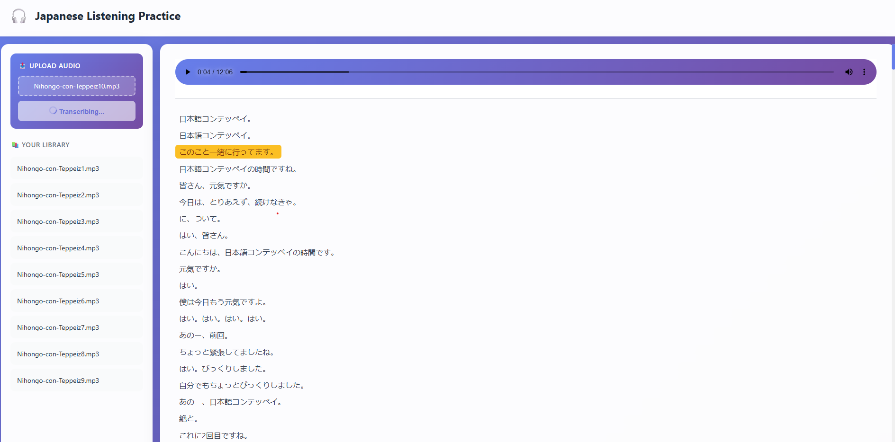

# 🎧 AudioScribe

A beautiful, modern web application for transcribing and managing audio files in any language using OpenAI's Whisper model. Perfect for language learners, podcasters, journalists, and anyone who needs accurate audio transcription with synchronized playback.


## ✨ Features

- 🎵 **Multi-Language Support** - Transcribe audio in 99+ languages (Japanese, English, Spanish, French, etc.)
- 🎙️ **Upload & Transcribe** - Automatic speech-to-text transcription for audio files
- 📚 **Audio Library** - Organize and manage multiple audio files
- 🔄 **Real-time Highlighting** - Synchronized text highlighting while audio plays
- 🎯 **Click to Seek** - Click any text segment to jump to that point in the audio
- 🗑️ **Easy Management** - Delete audio files with confirmation modals
- 💾 **Offline Support** - Works completely offline after setup
- 🎨 **Modern UI** - Beautiful gradient design with smooth animations
- ⚡ **Fast & Efficient** - CPU-optimized with optional GPU support

## 📸 Screenshots
### Main Interface

*Clean, modern interface with sidebar library and transcription viewer. The text also  automatically highlights in sync with audio playback.You can also click a specific segment and the audio will start playing from that point*


### Upload & Processing

*Simple upload with loading indicators and success confirmation*

---

## 🚀 Quick Start

### Prerequisites

- Python 3.8 or higher
- FFmpeg (required by Whisper)

### Installation

1. **Clone the repository**
   ```bash
   git clone https://github.com/Hujaifa-Git/audioscribe.git
   cd audioscribe
   ```

2. **Install FFmpeg**
   
   **Ubuntu/Debian:**
   ```bash
   sudo apt update
   sudo apt install ffmpeg
   ```
   
   **macOS:**
   ```bash
   brew install ffmpeg
   ```
   
   **Windows:**
   Download from [ffmpeg.org](https://ffmpeg.org/download.html) or use:
   ```bash
   choco install ffmpeg
   ```

3. **Install Python dependencies**
   ```bash
   pip install -r requirements.txt
   ```

4. **Configure the application** (optional)
   
   Edit `config.json` to customize settings:
   ```json
   {
     "language": "ja",
     "model_size": "base",
     "device": "cpu"
   }
   ```

5. **Run the application**
   ```bash
   uvicorn app:app --reload
   ```

6. **Open your browser**
   
   Navigate to `http://localhost:8000`

## ⚙️ Configuration

The `config.json` file allows you to customize the application behavior:

| Setting | Options | Description |
|---------|---------|-------------|
| `language` | `ja`, `en`, `es`, `fr`, etc. | Target language for transcription |
| `model_size` | `tiny`, `base`, `small`, `medium`, `large` | Whisper model size (larger = more accurate but slower) |
| `device` | `cpu`, `cuda` | Processing device (use `cuda` for GPU acceleration) |

### Model Size Guide

| Model | Parameters | VRAM | Speed | Accuracy |
|-------|-----------|------|-------|----------|
| tiny | 39M | ~1 GB | Fastest | Good |
| base | 74M | ~1 GB | Fast | Better |
| small | 244M | ~2 GB | Moderate | Good |
| medium | 769M | ~5 GB | Slow | Very Good |
| large | 1550M | ~10 GB | Slowest | Best |

**Recommendation:** Start with `base` for CPU usage or `small` for GPU usage.

## 🎯 Usage

1. **Upload Audio**
   - Click "Choose Audio File" to select an audio file
   - Click "Start Transcription" to process the file
   - Wait for the transcription to complete (loading indicator will show)

2. **Listen & Read**
   - Click on any audio file in the sidebar to load it
   - Press play and watch the text highlight in real-time
   - Click any text segment to jump to that part of the audio

3. **Manage Library**
   - Hover over audio files to see the delete button
   - Click the 🗑️ icon to remove files (with confirmation)

## 📁 Project Structure

```
japanese-transcription-app/
├── app.py               # Main FastAPI application
├── config.json          # Configuration file
├── requirements.txt     # Python dependencies
├── README.md            # This file
├── app.db               # SQLite database (auto-created)
└── uploads/             # Audio files storage (auto-created)
└── screenshots/         # Some Screenshots of the project
```

## 🛠️ Technology Stack

- **Backend:** FastAPI, SQLite
- **AI/ML:** OpenAI Whisper, PyTorch
- **Frontend:** HTML5, CSS3, Vanilla JavaScript
- **Audio:** FFmpeg

### Slow transcription
- Use a smaller model (`tiny` or `base`)
- Enable GPU acceleration if available
- Close other resource-intensive applications

## 🙏 Acknowledgments

- [OpenAI Whisper](https://github.com/openai/whisper) for the amazing speech recognition model
- [FastAPI](https://fastapi.tiangolo.com/) for the excellent web framework

---


⭐ If you found this project helpful, please consider giving it a star!
